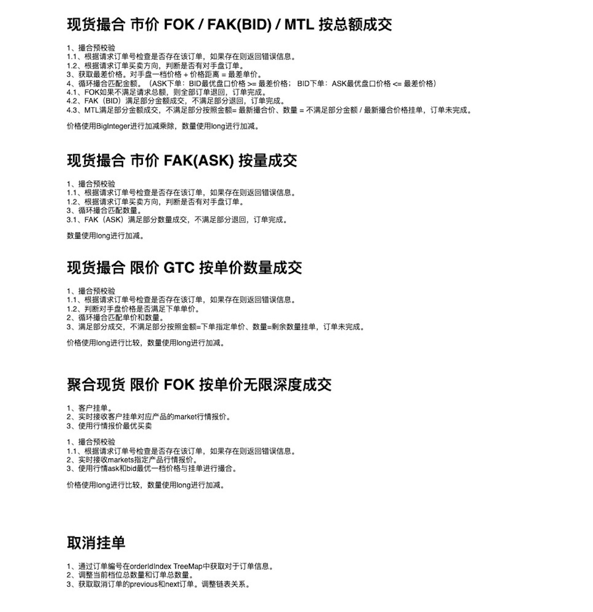
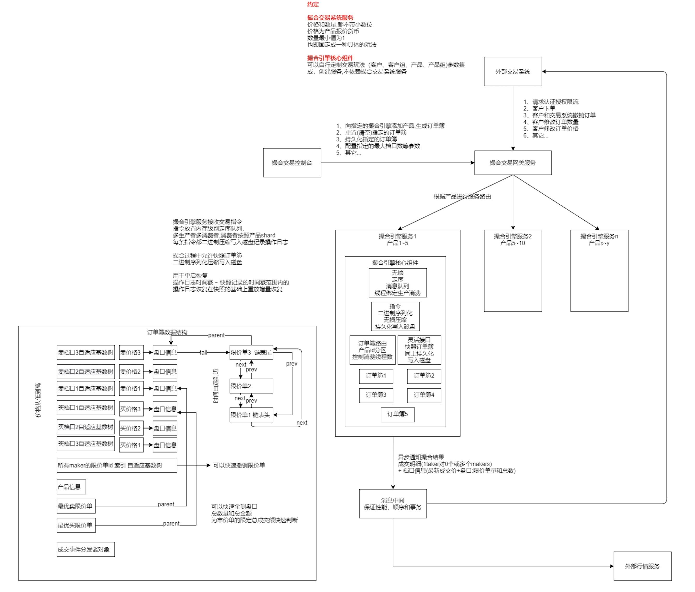

<b> match-engine-core <i>High-performance digital currency, foreign exchange, stock trading, and spot matching engine</i></b>

----

# Matchmaking system
> [中文](README.md) | English

High-performance digital currency, foreign exchange, stock trading, and spot matching engine

# Function list:

- 1. Supports multiple trading strategies: FOK, FAK, GTC
- 2. Rich open interfaces to facilitate quick access to mainstream payment systems and rapid development
- 3. Flexible parameter configuration capability, various transaction parameter configurations take effect in real time
- 4. Stable architecture, supporting high concurrency and horizontal expansion

<table>
  <tr>
     <td></td>
  </tr>
  <tr>
     <td></td>
  </tr>
</table>

# Main Specifications：

Exchange-core is an **open source market exchange core** based on
[LMAX Disruptor](https://github.com/LMAX-Exchange/disruptor),
[Eclipse Collections](https://www.eclipse.org/collections/) (ex. Goldman Sachs GS Collections),
[Real Logic Agrona](https://github.com/real-logic/agrona),
[OpenHFT Chronicle-Wire](https://github.com/OpenHFT/Chronicle-Wire),
[LZ4 Java](https://github.com/lz4/lz4-java),
and [Adaptive Radix Trees](https://db.in.tum.de/~leis/papers/ART.pdf).

Exchange-core includes:
- orders matching engine
- risk control and accounting module
- disk journaling and snapshots module
- trading, admin and reports API

Designed for high scalability and pauseless 24/7 operation under high-load conditions and providing low-latency responses:
- 3M users having 10M accounts in total
- 100K order books (symbols) having 4M pending orders in total
- less than 1ms worst wire-to-wire target latency for 1M+ operations per second throughput
- 150ns per matching for large market orders

Single order book configuration is capable to process 5M operations per second on 10-years old hardware (Intel® Xeon® X5690) with moderate latency degradation:

|rate|50.0%|90.0%|95.0%|99.0%|99.9%|99.99%|worst|
|----|-----|-----|-----|-----|-----|------|-----|
|125K|0.6µs|0.9µs|1.0µs|1.4µs|4µs  |24µs  |41µs |
|250K|0.6µs|0.9µs|1.0µs|1.4µs|9µs  |27µs  |41µs |
|500K|0.6µs|0.9µs|1.0µs|1.6µs|14µs |29µs  |42µs |
|  1M|0.5µs|0.9µs|1.2µs|4µs  |22µs |31µs  |45µs |
|  2M|0.5µs|1.2µs|3.9µs|10µs |30µs |39µs  |60µs |
|  3M|0.7µs|3.6µs|6.2µs|15µs |36µs |45µs  |60µs |
|  4M|1.0µs|6.0µs|9µs  |25µs |45µs |55µs  |70µs |
|  5M|1.5µs|9.5µs|16µs |42µs |150µs|170µs |190µs|
|  6M|5µs  |30µs |45µs |300µs|500µs|520µs |540µs|
|  7M|60µs |1.3ms|1.5ms|1.8ms|1.9ms|1.9ms |1.9ms|

Benchmark configuration:
- Single symbol order book.
- 3,000,000 inbound messages are distributed as follows: 9% GTC orders, 3% IOC orders, 6% cancel commands, 82% move commands. About 6% of all messages are triggering one or more trades.
- 1,000 active user accounts.
- In average ~1,000 limit orders are active, placed in ~750 different price slots.
- Latency results are only for risk processing and orders matching. Other stuff like network interface latency, IPC, journaling is not included.
- Test data is not bursty, meaning constant interval between commands (0.2~8µs depending on target throughput).
- BBO prices are not changing significantly throughout the test. No avalanche orders.
- No coordinated omission effect for latency benchmark. Any processing delay affects measurements for next following messages.
- GC is triggered prior/after running every benchmark cycle (3,000,000 messages).
- RHEL 7.5, network-latency tuned-adm profile, dual X5690 6 cores 3.47GHz, one socket isolated and tickless, spectre/meltdown protection disabled.

### Features
- HFT optimized. Priority is a limit-order-move operation mean latency (currently ~0.5µs). Cancel operation takes ~0.7µs, placing new order ~1.0µs;
- In-memory working state for accounting data and order books.
- Event-sourcing - disk journaling and journal replay support, state snapshots (serialization) and restore operations, LZ4 compression.
- Lock-free and contention-free orders matching and risk control algorithms.
- No floating-point arithmetic, no loss of significance is possible.
- Matching engine and risk control operations are atomic and deterministic.
- Pipelined multi-core processing (based on LMAX Disruptor): each CPU core is responsible for certain processing stage, user accounts shard, or symbol order books shard.
- Two different risk processing modes (specified per symbol): direct-exchange and margin-trade.
- Maker/taker fees (defined in quote currency units).
- Two order books implementations: simple implementation ("Naive") and performance implementation ("Direct").
- Order types: Immediate-or-Cancel (IOC), Good-till-Cancel (GTC), Fill-or-Kill Budget (FOK-B)
- Testing - unit-tests, integration tests, stress tests, integrity/consistency tests.
- Low GC pressure, objects pooling, single ring-buffer.
- Threads affinity (requires JNA).
- User suspend/resume operation (reduces memory consumption).
- Core reports API (user balances, open interest).

